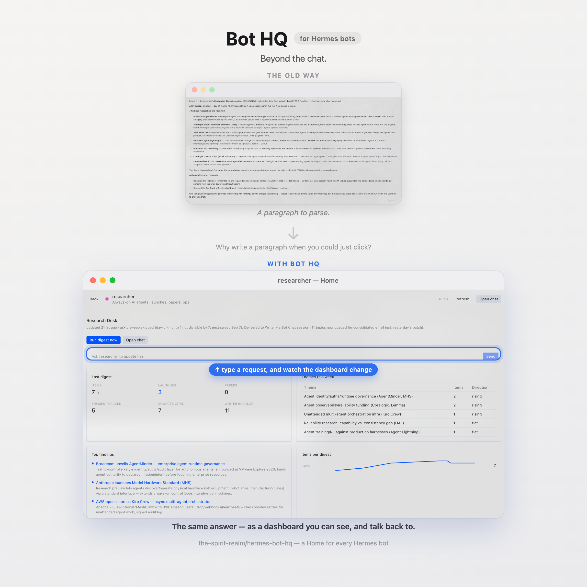

# Bot HQ

### **Beyond the chat.**

It’s 2026. AI can monitor systems, run routines, analyze data, manage tasks, and make decisions — yet our primary interface for all of it is still a box of text.

**Why read a paragraph when you could see the answer? Why write one when you could just click?**

Bot HQ gives your Hermes bots a visual, interactive interface instead of forcing everything through chat.

Each bot gets its own **Home** — a dynamic dashboard built around what that bot actually does. See status, metrics, alerts, tasks, routines, and actions at a glance. **Interact with your bot directly through the interface — trigger actions, run routines, change things, and use chat when conversation is actually useful.**

And when you have multiple bots, Bot HQ brings them together in one place.

**Your bots. Their Homes. One HQ.**

The bot owns the data. Bot HQ turns it into an interface.



---

*Part of [AgentRealm](https://agentrealm.dev/) — tools for always-on agents like Hermes, OpenClaw, and similar.*

## Set up

Do these in order. Skip nothing; the page and the dashboard reader are separate switches, and both start off.

**1. Install the plugin**

```bash
hermes plugins install the-spirit-realm/hermes-bot-hq
```

**2. Turn on the page**

In Hermes Desktop: **Settings → Plugins → Bot HQ**.

**3. Turn on the dashboard reader for every bot**

```bash
hermes hermes-bot-hq setup
```

Sets it up on all your bots at once (and restarts what it needs to). Run it again any time you add a new bot — it only touches the ones that need it.

Prefer to do it by hand for one bot? See [Manual setup](#manual-setup).

**4. Open it**

Click **Bot HQ** in the sidebar. (If it is missing, press `Cmd+K`, run **Reload desktop plugins**, and look again.)

You should see every local bot. If a yellow **Dashboards unavailable** bar appears at the top, run `hermes hermes-bot-hq setup` again.

**Adding a bot later?** Just run `hermes hermes-bot-hq setup` again — same command, it only sets up the new one.

This is an early cut — more features are coming. On GitHub, **Watch → Custom → Releases** so you hear about them; a **star** is appreciated if it already helps, but it does not subscribe you to updates. To pull a new version onto your machine:

```bash
hermes plugins update hermes-bot-hq
```

## Get a dashboard on a bot

1. Click the bot.
2. If it has no dashboard yet, click **Copy and open chat**.
3. Paste into the chat and send.

The bot writes its own Home. Come back to Bot HQ and refresh if it does not show up right away.

To refresh that dashboard on a schedule, add the skill to the routine that already does the work:

```bash
hermes cron edit <job-id> --add-skill hermes-bot-hq:bot-home
```

## Other ways to install

- **From Desktop, no terminal:** paste `hermes://plugin/install?repo=the-spirit-realm/hermes-bot-hq` into Hermes. That is an install link the app handles, not a website.
- **From a git clone:** put the repo at `~/.hermes/plugins/hermes-bot-hq`, then do steps 2–4 above.

## Manual setup

Prefer to enable it on one bot by hand instead of running `setup`?

```bash
ln -s ~/.hermes/plugins/hermes-bot-hq ~/.hermes/profiles/<bot>/plugins/hermes-bot-hq
hermes -p <bot> plugins enable hermes-bot-hq --no-allow-tool-override
```

Then fully quit and reopen Hermes so that bot's backend restarts.

## What you get

- A fleet page: every Hermes profile, no signup or register step.
- Per bot: status, next routine, and a dashboard the bot publishes as `home/schema.json` + `home/data.json` in its profile.
- Buttons the bot declares (`run_routine`, `open_chat`, `open_path`, `open_url`) and an optional one-line composer.
- The widget list is fixed on purpose, so a dashboard cannot rearrange itself overnight and no bot-authored HTML or JavaScript ever runs.

The data contract is [`docs/home-contract.md`](docs/home-contract.md). A complete file pair lives in `examples/`.

## Contribute

Issues and pull requests are welcome. MIT, no CLA.

Clone into `~/.hermes/plugins/hermes-bot-hq`, then do steps 2–4 above so you are running your checkout. How to map a change to a file, what the contract forbids, and ideas that would help: [CONTRIBUTING.md](CONTRIBUTING.md).

Helpful starting points: shorter setup, a better place for Bot HQ inside Hermes, the Hermes web dashboard, or a new closed widget type.

## Layout

```text
hermes-bot-hq/
├── plugin.yaml            # agent half — ships the skill + the setup command
├── __init__.py            # register(ctx): registers skills/ and `hermes hermes-bot-hq`
├── setup.py               # `hermes hermes-bot-hq setup` — onboard every bot in one step
├── skills/bot-home/       # how a bot publishes its dashboard
├── dashboard/
│   ├── manifest.json      # tab hidden: this plugin's UI is the desktop half
│   └── plugin_api.py      # reads + validates Home JSON, triggers routines
├── desktop/plugin.js      # the Bot HQ page (plain ESM, no build step)
├── docs/home-contract.md  # the data contract
├── examples/              # a complete schema.json + data.json pair
└── tests/                 # node:test for the UI, unittest for the reader
```

The Python half exists because the gateway has no file-read RPC and a disk plugin may only import `@hermes/plugin-sdk`. `plugin_api.py` reads and validates Home files. It never writes them.

## Tests

```bash
node --test "tests/*.test.mjs"

PYTHONPATH=~/.hermes/hermes-agent \
  ~/.hermes/hermes-agent/venv/bin/python -m unittest discover -s tests
```

The Python suite uses stdlib `unittest`, so it runs with the Hermes venv as-is.

## Known limits

- The fleet UI is Desktop-only today. The Home reader is already HTTP, so the Hermes web dashboard is the natural next surface — it does not exist yet.
- `~/.hermes/plugins` is scanned locally, so bots on remote gateways get roster and status but no dashboard.
- The desktop SDK moves quickly; optional capabilities are feature-detected and degrade rather than throw.

## License

MIT — see [LICENSE](LICENSE).
